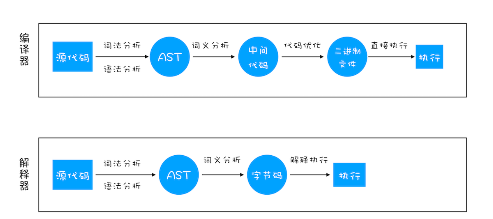
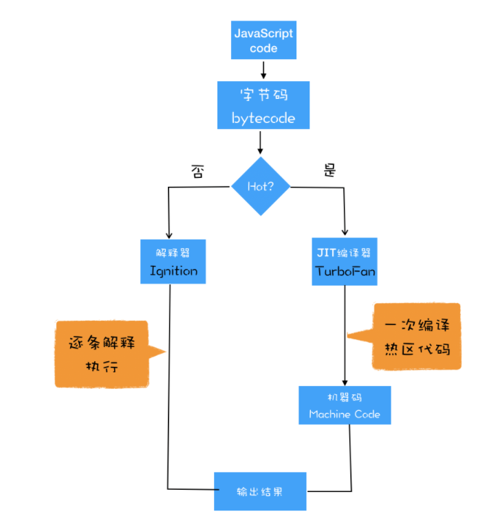

前端相对来说是一个比较新兴的领域，因此各种前端框架和工具层出不穷，让人眼花缭乱，尤其是各大厂商推出`小程序`之后`各自制定标准`，让前端开发的工作更加繁琐，在此背景下为了抹平平台之间的差异，诞生的各种`编译工具/框架`也数不胜数。但无论如何，想要赶上这些框架和工具的更新速度是非常难的，即使赶上了也很难产生自己的`技术积淀`，一个更好的方式便是学习那些`本质的知识`，抓住上层应用中不变的`底层机制`，这样我们便能轻松理解上层的框架而不仅仅是被动地使用，甚至能够在适当的场景下自己造出轮子，以满足开发效率的需求。

站在 V8 的角度，理解其中的执行机制，也能够帮助我们理解很多的上层应用，包括 Babel、Eslint、前端框架的底层机制。那么，一段 JavaScript 代码放在 V8 当中究竟是如何执行的呢？

首先需要明白的是，机器是读不懂 JS 代码，机器只能理解特定的机器码，那如果要让 JS 的逻辑在机器上运行起来，就必须将 JS 的代码翻译成机器码，然后让机器识别。JS 属于解释型语言，对于解释型的语言说，解释器会对源代码做如下分析:

- 通过词法分析和语法分析生成 AST(抽象语法树)
- 生成字节码

然后解释器根据字节码来执行程序。但 JS 整个执行的过程其实会比这个更加复杂，接下来就来一一地拆解。

编译型语言在程序执行之前，需要经过编译器的编译过程，并且编译之后会直接保留机器能读懂的二进制文件，这样每次运行程序时，都可以直接运行该二进制文件，而不需要再次重新编译了。比如 C/C++、GO 等都是编译型语言。 而由解释型语言编写的程序，在每次运行时都需要通过解释器对程序进行动态解释和执行。

## 1.生成抽象语法树（AST）和执行上下文

将源代码转换为抽象语法树，并生成执行上下文

> babel 和 eslint 的工作原理也都是基于 ast，taro 的编译也是

## 2. 生成字节码

字节码就是介于 AST 和机器码之间的一种代码。但是与特定类型的机器码无关，字节码需要通过解释器将其转换为机器码后才能执行。

理解了什么是字节码，我们再来对比下高级代码、字节码和机器码

从图中可以看出，机器码所占用的空间远远超过了字节码，所以使用字节码可以减少系统的内存使用。

字节码仍然需要转换为机器码，但和原来不同的是，现在不用一次性将全部的字节码都转换成机器码，而是通过 解释器来逐行执行字节码，省去了生成二进制文件的操作，这样就大大降低了内存的压力。

## 3. 执行代码

接下来，就进入到字节码解释执行的阶段啦！

**解释器 Ignition** 除了负责生成字节码之外，它还有另外一个作用，就是解释执行字节码。

在执行字节码的过程中，如果发现某一部分代码重复出现，那么 V8 将它记做`热点代码`(HotSpot)，然后将这么代码编译成`机器码`保存起来，这个用来编译的工具就是 V8 的`**编译器**`(也叫做`**TurboFan**`)
, 因此在这样的机制下，代码执行的时间越久，那么执行效率会越来越高，因为有越来越多的字节码被标记为`热点代码`，遇到它们时直接执行相应的机器码，不用再次将转换为机器码。

其实当你听到有人说 JS 就是一门解释器语言的时候，其实这个说法是有问题的。因为字节码不仅配合了解释器，而且还和编译器打交道，所以 JS 并不是完全的解释型语言。而编译器和解释器的 根本区别在于前者会编译生成二进制文件但后者不会。

并且，这种字节码跟编译器和解释器结合的技术，我们称之为`即时编译`, 也就是我们经常听到的`JIT`。

这就是 V8 中执行一段 JS 代码的整个过程，梳理一下:

1. 首先通过词法分析和语法分析生成 `AST`
1. 将 AST 转换为字节码
1. 由解释器逐行执行字节码，遇到热点代码启动编译器进行编译，生成对应的机器码, 以优化执行效率

关于这个问题的拆解就到这里，希望对你有所启发。

# JavaScript 的性能优化

- 提升单次脚本的执行速度，避免 JavaScript 的长任务霸占主线程，这样可以使得页面快速响应交互；
- 避免大的内联脚本，因为在解析 HTML 的过程中，解析和编译也会占用主线程；
- 减少 JavaScript 文件的容量，因为更小的文件会提升下载速度，并且占用更低的内存。

# 总结

- 首先我们介绍了编译器和解释器的区别。
- 紧接着又详细分析了 V8 是如何执行一段 JavaScript 代码的：V8 依据 JavaScript 代码生成 AST 和执行上下文，再基于 AST 生成字节码，
- 然后通过解释器执行字节码，通过编译器来优化编译字节码。基于字节码和编译器，我们又介绍了 JIT 技术。
- 最后我们延伸说明了下优化 JavaScript 性能的一些策略。

问题： 编译的基本单位是一段 JS 代码（内敛 JS）或者一个 JS 文件吗(还是以当前调用栈将要执行函数为单位）？

全局代码，或者函数 ！ 比如下载完一个 js 文件，先编译这个 js 文件,但是 js 文件内定义的函数是不会编译的。 等调用到该函数的时候，Javascript 引擎才会去编译该函数！

# 参考文章

[三元博客](https://sanyuan0704.top/blogs/javascript/js-v8/003.html#_3-%E6%89%A7%E8%A1%8C%E4%BB%A3%E7%A0%81)
