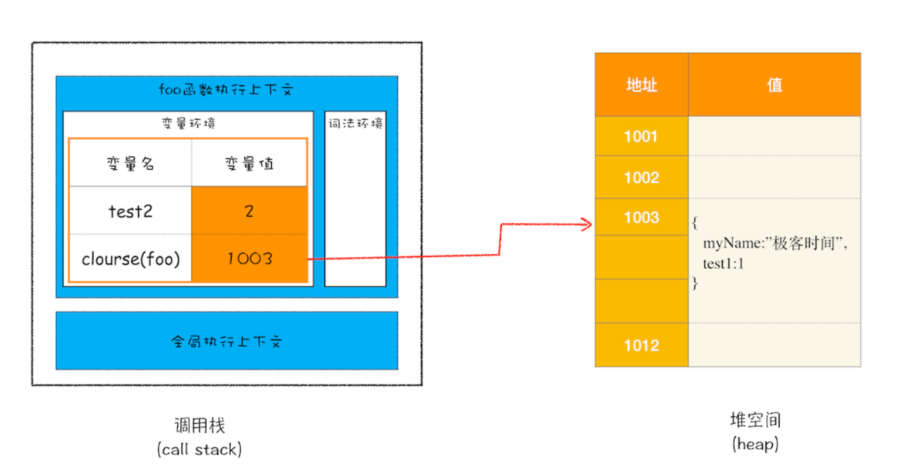

# 栈空间和堆空间：数据是如何存储的？
原始类型的数据值都是直接保存在“栈”中的，引用类型的值是存放在“堆”中的 
> **不严谨！！！！**
```javascript
function foo(){
    var a = "极客时间"
    var b = a
    var c = {name:"极客时间"}
    var d = c
}
foo()
```
为什么一定要分“堆”和“栈”两个存储空间呢？所有数据直接存放在“栈”中不就可以了吗？

答案是不可以的。这是因为 JavaScript 引擎需要用栈来维护程序执行期间上下文的状态，如果栈空间大了话，所有的数据都存放在栈空间里面，那么会影响到上下文切换的效率，进而又影响到整个程序的执行效率。

比如文中的 foo 函数执行结束了，JavaScript 引擎需要离开当前的执行上下文，只需要将指针下移到上个执行上下文的地址就可以了，foo 函数执行上下文栈区空间全部回收，具体过程你可以参考下图：

所以通常情况下，栈空间都不会设置太大，主要用来存放一些原始类型的小数据。而引用类型的数据占用的空间都比较大，所以这一类数据会被存放到堆中，堆空间很大，能存放很多大的数据，不过缺点是分配内存和回收内存都会占用一定的时间。

# 再谈闭包
现在你知道了作用域内的原始类型数据会被存储到栈空间，引用类型会被存储到堆空间，基于这两点的认知，我们再深入一步，探讨下闭包的内存模型。
```javascript
function foo() {
    var myName = "极客时间"
    let test1 = 1
    const test2 = 2
    var innerBar = { 
        setName:function(newName){
            myName = newName
        },
        getName:function(){
            console.log(test1)
            return myName
        }
    }
    return innerBar
}
var bar = foo()
bar.setName("极客邦")
bar.getName()
console.log(bar.getName())
```

1. 当 JavaScript 引擎执行到 foo 函数时，首先会编译，并创建一个空执行上下文。
1. 在编译过程中，遇到内部函数 setName，JavaScript 引擎还要对内部函数做一次快速的词法扫描，发现该内部函数引用了 foo 函数中的 myName 变量，由于是内部函数引用了外部函数的变量，所以 JavaScript 引擎判断这是一个闭包，于是在堆空间创建换一个“closure(foo)”的对象（这是一个内部对象，JavaScript 是无法访问的），用来保存 myName 变量。
1. 接着继续扫描到 getName 方法时，发现该函数内部还引用变量 test1，于是 JavaScript 引擎又将 test1 添加到“closure(foo)”对象中。这时候堆中的“closure(foo)”对象中就包含了 myName 和 test1 两个变量了。
1. 由于 test2 并没有被内部函数引用，所以 test2 依然保存在调用栈中。

通过上面的分析，我们可以画出执行到 foo 函数中“return innerBar”语句时的调用栈状态，如下图所示：


从上图你可以清晰地看出，当执行到 foo 函数时，闭包就产生了；当 foo 函数执行结束之后，返回的 getName 和 setName 方法都引用“closure(foo)”对象，所以即使 foo 函数退出了，“ closure(foo)”依然被其内部的 getName 和 setName 方法引用。所以在下次调用bar.setName或者bar.getName时，创建的执行上下文中就包含了“closure(foo)”。

总的来说，产生闭包的核心有两步：**第一步是需要预扫描内部函数**；**第二步是把内部函数引用的外部变量保存到堆中。**


# 总结
我们介绍了 JavaScript 中的 8 种数据类型，它们可以分为两大类——原始类型和引用类型。其中，原始类型的数据是存放在栈中，引用类型的数据是存放在堆中的。堆中的数据是通过引用和变量关联起来的。也就是说，JavaScript 的变量是没有数据类型的，值才有数据类型，变量可以随时持有任何类型的数据。


