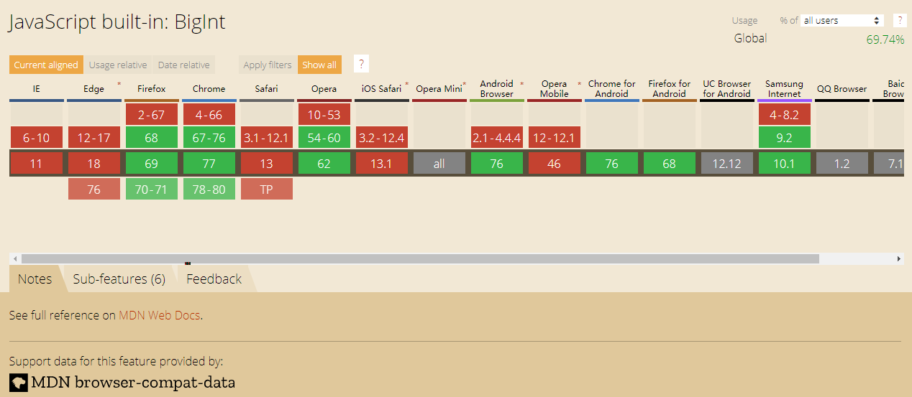

## 什么是 BigInt?

> BigInt 是一种新的数据类型，用于当整数值大于 Number 数据类型支持的范围时。这种数据类型允许我们安全地对`大整数`执行算术操作，表示高分辨率的时间戳，使用大整数 id，等等，而不需要使用库。

## 为什么需要 BigInt?

在 JS 中，所有的数字都以双精度 64 位浮点格式表示，那这会带来什么问题呢？

这导致 JS 中的 Number 无法精确表示非常大的整数，它会将非常大的整数四舍五入，确切地说，JS 中的 Number 类型只能安全地表示-9007199254740991(-(253-1))和 9007199254740991（(253-1)），任何超出此范围的整数值都可能失去精度。

```javascript
console.log(999999999999999) //=>10000000000000000
```

同时也会有一定的安全性问题:

```javascript
9007199254740992 === 9007199254740993 // → true 居然是true!
```

## 如何创建并使用 BigInt？

要创建 BigInt，只需要在数字末尾追加 n 即可。

```javascript
console.log(9007199254740995n) // → 9007199254740995n
console.log(9007199254740995) // → 9007199254740996
```

另一种创建 BigInt 的方法是用 BigInt()构造函数、

```javascript
BigInt('9007199254740995') // → 9007199254740995n
```

简单使用如下:

```javascript
10n + 20n // → 30n
10n -
  20n + // → -10n
  10n - // → TypeError: Cannot convert a BigInt value to a number
  10n // → -10n
10n * 20n // → 200n
20n / 10n // → 2n
23n % 10n // → 3n
10n ** 3n // → 1000n

let x = 10n
++x // → 11n
--x // → 9n
console.log(typeof x) //"bigint"
```

## 值得警惕的点

1.  BigInt 不支持一元加号运算符, 这可能是某些程序可能依赖于 + 始终生成 Number 的不变量，或者抛出异常。另外，更改 + 的行为也会破坏 asm.js 代码。
1.  因为隐式类型转换可能丢失信息，所以不允许在 bigint 和 Number 之间进行混合操作。当混合使用大整数和浮点数时，结果值可能无法由 BigInt 或 Number 精确表示。

```javascript
10 + 10n // → TypeError
```

3. 不能将 BigInt 传递给 Web api 和内置的 JS 函数，这些函数需要一个 Number 类型的数字。尝试这样做会报 TypeError 错误。

```javascript
Math.max(2n, 4n, 6n) // → TypeError
```

4. 当 Boolean 类型与 BigInt 类型相遇时，BigInt 的处理方式与 Number 类似，换句话说，只要不是 0n，BigInt 就被视为 truthy 的值。

```javascript
if (0n) {
  //条件判断为false
}
if (3n) {
  //条件为true
}
```

5.  元素都为 BigInt 的数组可以进行 sort。
6.  BigInt 可以正常地进行位运算，如|、&、<<、>>和^

## 浏览器兼容性

caniuse 的结果:



其实现在的兼容性并不怎么好，只有 chrome67、firefox、Opera 这些主流实现，要正式成为规范，其实还有很长的路要走。

我们期待 BigInt 的光明前途！
