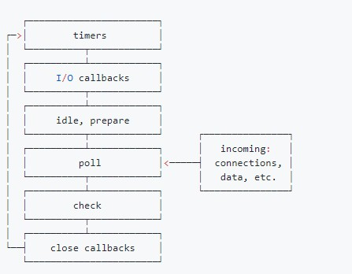

# 如何理解 EventLoop——宏任务和微任务篇

## 宏任务(MacroTask)引入

在 JS 中，大部分的任务都是在主线程上执行，常见的任务有:

1. 渲染事件
1. 用户交互事件
1. js 脚本执行
1. 网络请求、文件读写完成事件等等。
1. setTimeout, setInterval, setImmediate(Node 独有)
1. 事件绑定的回调函数, 如网络请求, dom 事件(除特殊的, 如 MutationObserver)
1. requestAnimationFrame
1. MessageChannel

为了让这些事件有条不紊地进行，JS 引擎需要对之执行的顺序做一定的安排，V8 其实采用的是一种`队列`的方式来存储这些任务，<br />即先进来的先执行。模拟如下:

```javascript
bool keep_running = true;
void MainTherad(){
  for(;;){
    //执行队列中的任务
    Task task = task_queue.takeTask();
    ProcessTask(task);

    //执行延迟队列中的任务
    ProcessDelayTask()

    if(!keep_running) //如果设置了退出标志，那么直接退出线程循环
        break;
  }
}
```

这里用到了一个 for 循环，将队列中的任务一一取出，然后执行，这个很好理解。但是其中包含了两种任务队列，除了上述提到的任务队列， 还有一个**延迟队列**，它专门处理诸如 setTimeout/setInterval 这样的定时器回调任务。

> 关于 setTimeout 的几点
>
> 1. 如果当前任务执行时间过久，会影响定时器任务的执行
> 1. 如果 setTimeout 存在嵌套调用且超过五层，那么系统会设置最短时间间隔为 4 毫秒
> 1. 未激活的页面，setTimeout 执行最小间隔是 1000 毫秒
> 1. 延时执行时间有最大值 Chrome、Safari、Firefox 都是以 32 个 bit 来存储延时值的，32bit 最大只能存放的数字是 2147483647 毫秒，这就意味着，如果 setTimeout 设置的延迟值大于 2147483647 毫秒（大约 24.8 天）时就会溢出，那么相当于延时值被设置为 0 了，这导致定时器会被立即执行。
> 1. 如果被 setTimeout 推迟执行的回调函数是某个对象的方法，那么该方法中的 this 关键字将指向全局环境，而不是定义时所在的那个对象。可以用 bind 解决
> 1. setTimeout 设置的回调任务实时性并不是太好，所以很多场景并不适合使用 setTimeout。比如你要使用 JavaScript 来实现动画效果，函数 requestAnimationFrame 就是个很好的选择。requestAnimationFrame 提供一个原生的 API 去执行动画的效果，它会在一帧（一般是 16ms）间隔内根据选择浏览器情况去执行相关动作。

上述提到的，普通任务队列和延迟队列中的任务，都属于**宏任务**。

## 微任务(MicroTask)引入

对于每个宏任务而言，其内部都有一个微任务队列。那为什么要引入微任务？微任务在什么时候执行呢？

其实引入微任务的初衷是为了解决异步回调的问题。想一想，对于异步回调的处理，有多少种方式？总结起来有两点:

1. 将异步回调进行宏任务队列的入队操作。
1. 将异步回调放到当前宏任务的末尾。

如果采用第一种方式，那么执行回调的时机应该是在前面`所有的宏任务`完成之后，倘若现在的任务队列非常长，那么回调迟迟得不到执行，造成`应用卡顿`。

为了规避这样的问题，V8 引入了第二种方式，这就是`微任务`的解决方式。在每一个宏任务中定义一个**微任务队列**，当该宏任务执行完成，会检查其中的微任务队列，如果为空则直接执行下一个宏任务，如果不为空，则`依次执行微任务`，执行完成才去执行下一个宏任务。

常见的微任务有 `MutationObserver`、`Promise.then`(或`.reject`) 以及以 `Promise` 为基础开发的其他技术(比如 fetch API), 还包括 `V8 的垃圾回收过程`。

> process.nextTick (node 独有)  
>  Object.observe

Ok, 这便是`宏任务`和`微任务`的概念。

# 浏览器篇

干讲理论不容易理解，让我们直接以一个例子开始吧:

```javascript
console.log('start')
setTimeout(() => {
  console.log('timeout')
})
Promise.resolve().then(() => {
  console.log('resolve')
})
console.log('end')
```

我们来分析一下:

1. 刚开始整个脚本作为一个宏任务来执行，对于同步代码直接压入执行栈(关于执行栈，若不了解请移步之前的文章《JavaScript 内存机制之问——数据是如何存储的？》)进行执行，因此**先打印 start 和 end**
1. setTimeout 作为一个宏任务放入宏任务队列
1. Promise.then 作为一个为微任务放入到微任务队列
1. 当本次宏任务执行完，检查微任务队列，发现一个 Promise.then, **执行**
1. 接下来进入到下一个宏任务——setTimeout, **执行**

因此最后的顺序是:

```
start
end
resolve
timeout
```

这样就带大家直观地感受到了浏览器环境下 EventLoop 的执行流程。不过，这只是其中的一部分情况，接下来我们来做一个更完整的总结。

1. 一开始整段脚本作为第一个**宏任务**执行
1. 执行过程中同步代码直接执行，**宏任务**进入宏任务队列，**微任务**进入微任务队列
1. 当前宏任务执行完出队，检查微任务队列，如果有则依次执行，直到微任务队列为空
1. 执行浏览器 UI 线程的渲染工作
1. 检查是否有 Web worker 任务，有则执行
1. 执行队首新的宏任务，回到 2，依此循环，直到宏任务和微任务队列都为空

最后给大家留一道题目练习:

```javascript
Promise.resolve().then(() => {
  console.log('Promise1')
  Promise.resolve().then(() => {
    console.log('Promise2')
  })
  setTimeout(() => {
    console.log('setTimeout2')
  }, 0)
})
setTimeout(() => {
  console.log('setTimeout1')
  Promise.resolve().then(() => {
    console.log('Promise3')
  })
}, 0)
console.log('start')

// start
// Promise1
// Promise2
// setTimeout1
// Promise3
// setTimeout2
```

```javascript
console.log('start')
setTimeout(() => {
  console.log('setTimeout')
}, 0)
new Promise((resolve, reject) => {
  console.log('promise1')
  resolve()
}).then(function () {
  console.log('promise2')
})
console.log('end')
// start
// promise1
// end
// promise2
// setTimeout
```

> promise 里面的回调是立即执行的, 后面的 then 是在微任务队列里, 微任务产生的微任务还在本轮循环里
> 宏任务先执行, 大于微任务, 宏任务执行一个, 清空微任务队列, 再执行一个宏任务

整体 js 代码就是一个宏任务, 所以整体先执行, 遇见 promise 执行里面回调函数, then 放在微任务里<br />然后继续执行同步代码<br />整体执行结束, 一个宏任务执行完了, 清空微任务<br />然后再执行宏任务

** MutationObserver **相关

> Mutation Event 采用了**观察者的设计模式**，当 DOM 有变动时就会立刻触发相应的事件，这种方式属于同步回调。采用 Mutation Event 解决了实时性的问题，因为 DOM 一旦发生变化，就会立即调用 JavaScript 接口。但也正是这种实时性造成了严重的性能问题
>
> DOM4 使用 MutationObserver 来代替 Mutation Event
> 首先，MutationObserver 将响应函数改成异步调用，可以不用在每次 DOM 变化都触发异步调用，而是等多次 DOM 变化后，**一次触发异步调用**，并且还会使用一个数据结构来记录这期间所有的 DOM 变化。这样即使频繁地操纵 DOM，也不会对性能造成太大的影响。
>
> MutationObserver 采用了“**异步 + 微任务**”的策略。
> 通过**异步**操作解决了同步操作的**性能问题**；
> 通过**微任务**解决了**实时性的问题**。

# nodejs 篇

nodejs 和 浏览器的 eventLoop 还是有很大差别的，值得单独拿出来说一说。

不知你是否看过关于 nodejs 中 eventLoop 的一些文章, 是否被这些流程图搞得眼花缭乱、一头雾水:



看到这你不用紧张，这里会抛开这些晦涩的流程图，以最清晰浅显的方式来一步步拆解 nodejs 的事件循环机制。

## 1. 三大关键阶段

首先，梳理一下 nodejs 三个非常重要的执行阶段:

1.  执行 `定时器回调` 的阶段。检查定时器，如果到了时间，就执行回调。这些定时器就是 setTimeout、setInterval。这个阶段暂且叫它`timer`。
1.  轮询(英文叫`poll`)阶段。因为在 node 代码中难免会有异步操作，比如文件 I/O，网络 I/O 等等，那么当这些异步操作做完了，就会来通知 JS 主线程，怎么通知呢？就是通过'data'、<br />'connect'等事件使得事件循环到达 `poll` 阶段。到达了这个阶段后:

如果当前已经存在定时器，而且有定时器到时间了，拿出来执行，eventLoop 将回到 timer 阶段。

如果没有定时器, 会去看回调函数队列。

- 如果队列`不为空`，拿出队列中的方法依次执行
- 如果队列`为空`，检查是否有 `setImmdiate` 的回调
  - 有则前往`check阶段`(下面会说)
  - `没有则继续等待`，相当于阻塞了一段时间(阻塞时间是有上限的), 等待 callback 函数加入队列，加入后会立刻执行。一段时间后`自动进入 check 阶段`。

3. check 阶段。这是一个比较简单的阶段，直接`执行 setImmdiate` 的回调。

这三个阶段为一个循环过程。不过现在的 eventLoop 并不完整，我们现在就来一一地完善。

## 2. 完善

首先，当第 1 阶段结束后，可能并不会立即等待到异步事件的响应，这时候 nodejs 会进入到 `I/O异常的回调阶段`。比如说 TCP 连接遇到 ECONNREFUSED，就会在这个时候执行回调。

并且在 check 阶段结束后还会进入到 `关闭事件的回调阶段`。如果一个 socket 或句柄（handle）被突然关闭，例如 socket.destroy()，<br />'close' 事件的回调就会在这个阶段执行。

梳理一下，nodejs 的 eventLoop 分为下面的几个阶段:

1. timer 阶段
1. I/O 异常回调阶段
1. 空闲、预备状态(第 2 阶段结束，poll 未触发之前)
1. poll 阶段
1. check 阶段
1. 关闭事件的回调阶段

是不是清晰了许多？

## 3. 实例演示

好，我们以上次的练习题来实践一把:

```javascript
setTimeout(() => {
  console.log('timer1')
  Promise.resolve().then(function () {
    console.log('promise1')
  })
}, 0)
setTimeout(() => {
  console.log('timer2')
  Promise.resolve().then(function () {
    console.log('promise2')
  })
}, 0)
```

这里我要说，node 版本 >= 11 和在 11 以下的会有不同的表现。

首先说 node 版本 >= 11 的，它会和浏览器表现一致，一个定时器运行完立即运行相应的微任务。

```
timer1
promise1
time2
promise2
```

而 node 版本小于 11 的情况下，对于定时器的处理是:

> 若第一个定时器任务出队并执行完，发现队首的任务仍然是一个定时器，那么就将微任务暂时保存，`直接去执行`新的定时器任务，当新的定时器任务执行完后，`再一一执行`中途产生的微任务。

因此会打印出这样的结果:

```
timer1
timer2
promise1
promise2
```

## 4.nodejs 和 浏览器关于 eventLoop 的主要区别

两者最主要的区别在于浏览器中的微任务是在`每个相应的宏任务`中执行的，而 nodejs 中的微任务是在`不同阶段之间`执行的。

## 5.关于 process.nextTick 的一点说明

process.nextTick 是一个独立于 eventLoop 的任务队列。<br />在每一个 eventLoop 阶段完成后会去检查这个队列，如果里面有任务，会让这部分任务`优先于微任务`执行。

# 参考文章

[三元博客](https://sanyuan0704.top/)
[https://www.youtube.com/watch?v=8aGhZQkoFbQ](https://www.youtube.com/watch?v=8aGhZQkoFbQ)
[http://latentflip.com/loupe/](http://latentflip.com/loupe/)
