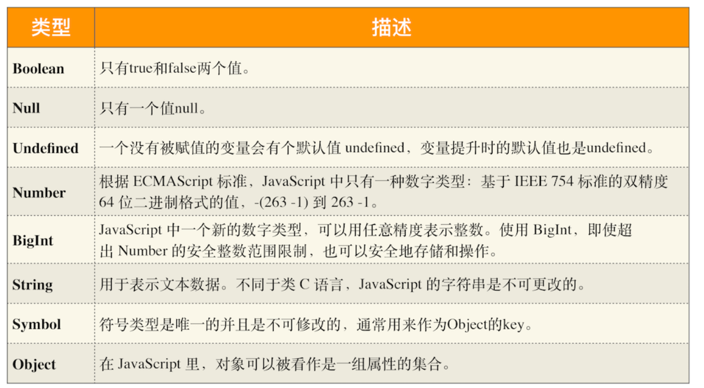

## 1.JS原始数据类型有哪些？引用数据类型有哪些？

在 JS 中，存在着 7 种原始值，分别是：

- boolean
- null
- undefined
- number
- string
- symbol
- bigint

引用数据类型:

对象Object（包含普通对象-Object，数组对象-Array，正则对象-RegExp，日期对象-Date，数学函数-Math，函数对象-Function）


## 2.说出下面运行的结果，解释原因。

```javascript
function test(person) {
  person.age = 26
  person = {
    name: 'hzj',
    age: 18
  }
  return person
}
const p1 = {
  name: 'fyq',
  age: 19
}
const p2 = test(p1)
console.log(p1) // -> ?
console.log(p2) // -> ?
```

结果:

```
p1：{name: “fyq”, age: 26}
p2：{name: “hzj”, age: 18}
```

> 原因: 在函数传参的时候传递的是对象在堆中的内存地址值，test函数中的实参person是p1对象的内存地址，通过调用person.age = 26确实改变了p1的值，但随后person变成了另一块内存空间的地址，并且在最后将这另外一份内存空间的地址返回，赋给了p2。


## 3.null是对象吗？为什么？

结论: null不是对象。

解释: 虽然 typeof null 会输出 object，但是这只是 JS 存在的一个悠久 Bug。在 JS 的最初版本中使用的是 32 位系统，为了性能考虑使用低位存储变量的类型信息，000 开头代表是对象然而 null 表示为全零，所以将它错误的判断为 object 。


## 4.'1'.toString()为什么可以调用？

其实在这个语句运行的过程中做了这样几件事情：

```javascript
var s = new String('1');
s.toString();
s = null;
```

第一步: 创建String类实例。

第二步: 调用实例方法。

第三步: 执行完方法立即销毁这个实例。

整个过程体现了`基本包装类型`的性质，而基本包装类型恰恰属于基本数据类型，包括Boolean, Number和String。

> 参考:《JavaScript高级程序设计(第三版)》P118


## 5.0.1+0.2为什么不等于0.3？

0.1和0.2在转换成二进制后会无限循环，由于标准位数的限制后面多余的位数会被截掉，此时就已经出现了精度的损失，相加后因浮点数小数位的限制而截断的二进制数字在转换为十进制就会变成0.30000000000000004。
