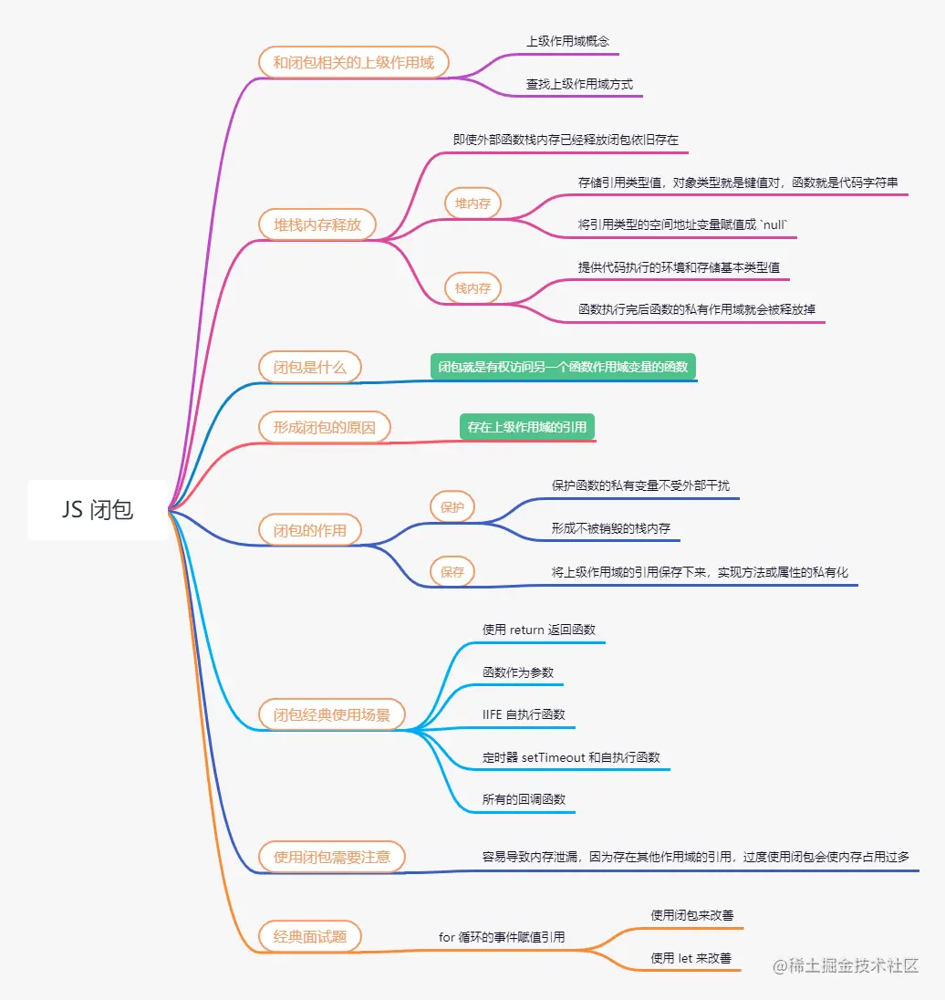

## 什么是闭包？

红宝书(p178)上对于闭包的定义：闭包是指有权访问另外一个函数作用域中的变量的函数，

MDN ： 
> 一个函数和对其周围状态（**lexical environment，词法环境**）的引用捆绑在一起（或者说函数被引用包围），这样的组合就是**闭包**（**closure**）。也就是说，闭包让你可以在一个内层函数中访问到其外层函数的作用域。在 JavaScript 中，每当创建一个函数，闭包就会在函数创建的同时被创建出来。

[https://developer.mozilla.org/zh-CN/docs/Web/JavaScript/Closures](https://developer.mozilla.org/zh-CN/docs/Web/JavaScript/Closures)


## 闭包产生的原因?

首先要明白作用域链的概念，其实很简单，在ES5中只存在两种作用域————全局作用域和函数作用域，`当访问一个变量时，解释器会首先在当前作用域查找标示符，如果没有找到，就去父作用域找，直到找到该变量的标示符或者不在父作用域中，这就是作用域链`，值得注意的是，每一个子函数都会拷贝上级的作用域，形成一个作用域的链条。 比如:

```javascript
var a = 1;
function f1() {
  var a = 2
  function f2() {
    var a = 3;
    console.log(a);//3
  }
}
```

在这段代码中，f1的作用域指向有全局作用域(window)和它本身，而f2的作用域指向全局作用域(window)、f1和它本身。而且作用域是从最底层向上找，直到找到全局作用域window为止，如果全局还没有的话就会报错。就这么简单一件事情！

闭包产生的本质就是，当前环境中存在指向父级作用域的引用。还是举上面的例子:

```javascript
function f1() {
  var a = 2
  function f2() {
    console.log(a);//2
  }
  return f2;
}
var x = f1();
x();
```

这里x会拿到父级作用域中的变量，输出2。因为在当前环境中，含有对f2的引用，f2恰恰引用了window、f1和f2的作用域。因此f2可以访问到f1的作用域的变量。

那是不是只有返回函数才算是产生了闭包呢？、

回到闭包的本质，我们只需要让父级作用域的引用存在即可，因此我们还可以这么做：

```javascript
var f3;
function f1() {
  var a = 2
  f3 = function() {
    console.log(a);
  }
}
f1();
f3();
```

让f1执行，给f3赋值后，等于说现在`f3拥有了window、f1和f3本身这几个作用域的访问权限`，还是自底向上查找，`最近是在f1`中找到了a,因此输出2。

在这里是外面的变量`f3存在着父级作用域的引用`，因此产生了闭包，形式变了，本质没有改变。


## 闭包有哪些表现形式?

明白了本质之后，我们就来看看，在真实的场景中，究竟在哪些地方能体现闭包的存在？

1. 返回一个函数。刚刚已经举例。
1. 作为函数参数传递

```javascript
var a = 1;
function foo(){
  var a = 2;
  function baz(){
    console.log(a);
  }
  bar(baz);
}
function bar(fn){
  // 这就是闭包
  fn();
}
// 输出2，而不是1
foo();
```

3. 在定时器、事件监听、Ajax请求、跨窗口通信、Web Workers或者任何异步中，只要使用了回调函数，实际上就是在使用闭包。

以下的闭包保存的仅仅是window和当前作用域。

```javascript
// 定时器
setTimeout(function timeHandler(){
  console.log('111');
}，100)

// 事件监听
$('#app').click(function(){
  console.log('DOM Listener');
})
```

4. IIFE(立即执行函数表达式)创建闭包, 保存了`全局作用域window`和`当前函数的作用域`，因此可以全局的变量。

```javascript
var a = 2;
(function IIFE(){
  // 输出2
  console.log(a);
})();
```


## 如何解决下面的循环输出问题？

```javascript
for(var i = 1; i <= 5; i ++){
  setTimeout(function timer(){
    console.log(i)
  }, 0)
}
```

为什么会全部输出6？如何改进，让它输出1，2，3，4，5？(方法越多越好)

因为setTimeout为宏任务，由于JS中单线程eventLoop机制，在主线程同步任务执行完后才去执行宏任务，因此循环结束后setTimeout中的回调才依次执行，但输出i的时候当前作用域没有，往上一级再找，发现了i,此时循环已经结束，i变成了6。因此会全部输出6。

解决方法：

1、利用IIFE(立即执行函数表达式)当每次for循环时，把此时的i变量传递到定时器中

```javascript
for(var i = 1;i <= 5;i++){
  (function(j){
    setTimeout(function timer(){
      console.log(j)
    }, 0)
  })(i)
}
```

2、给定时器传入第三个参数, 作为timer函数的第一个函数参数

```javascript
for(var i=1;i<=5;i++){
  setTimeout(function timer(j){
    console.log(j)
  }, 0, i)
}
```

3、使用ES6中的let

```javascript
for(let i = 1; i <= 5; i++){
  setTimeout(function timer(){
    console.log(i)
  },0)
}
```

let使JS发生革命性的变化，让JS有函数作用域变为了块级作用域，用let后作用域链不复存在。代码的作用域以块级为单位，以上面代码为例:

```
// i = 1
{
  setTimeout(function timer(){
    console.log(1)
  },0)
}
// i = 2
{
  setTimeout(function timer(){
    console.log(2)
  },0)
}
// i = 3
...
```

因此能输出正确的结果。
