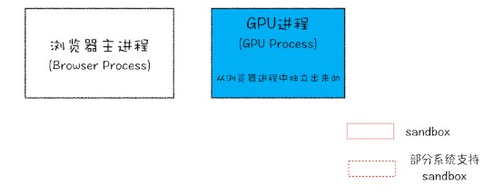
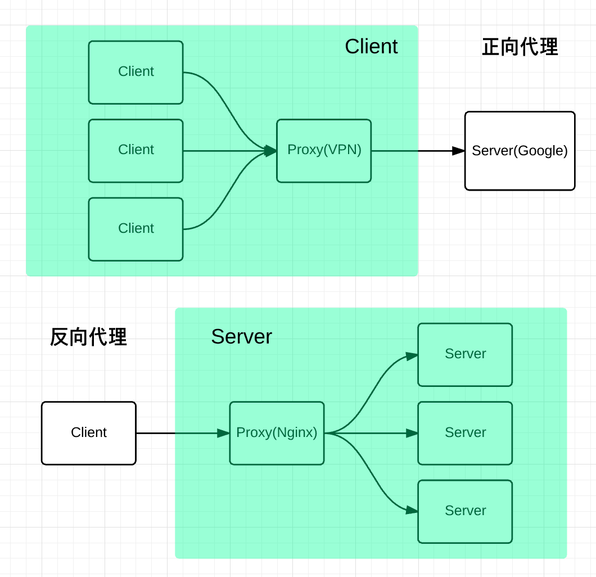

在前后端分离的开发模式中，经常会遇到跨域问题，即 Ajax 请求发出去了，服务器也成功响应了，前端就是拿不到这个响应。接下来我们就来好好讨论一下这个问题。


## 什么是跨域

回顾一下 URI 的组成:


浏览器遵循**同源政策**(`scheme(协议)`、`host(主机)`和`port(端口)`都相同则为`同源`)。非同源站点有这样一些限制:

- 不能读取和修改对方的 DOM
- 不读访问对方的 Cookie、IndexDB 和 LocalStorage
- 限制 XMLHttpRequest 请求。(后面的话题着重围绕这个)

当浏览器向目标 URI 发 Ajax 请求时，只要当前 URL 和目标 URL 不同源，则产生跨域，被称为`跨域请求`。

跨域请求的响应一般会被浏览器所拦截，注意，是被浏览器拦截，响应其实是成功到达客户端了。那这个拦截是如何发生呢？

首先要知道的是，浏览器是多进程的，以 Chrome 为例，进程组成如下：<br />
**WebKit 渲染引擎**和**V8 引擎**都在渲染进程当中。

当`xhr.send`被调用，即 Ajax 请求准备发送的时候，其实还只是在渲染进程的处理。为了防止黑客通过脚本触碰到系统资源，浏览器将每一个渲染进程装进了沙箱，并且为了防止 CPU 芯片一直存在的**Spectre** 和 **Meltdown**漏洞，采取了`站点隔离`的手段，给每一个不同的站点(一级域名不同)分配了沙箱，互不干扰。具体见[YouTube上Chromium安全团队的演讲视频](https://www.youtube.com/watch?v=dBuykrdhK-A&feature=emb_logo)。

在沙箱当中的渲染进程是没有办法发送网络请求的，那怎么办？只能通过网络进程来发送。那这样就涉及到进程间通信(IPC，Inter Process Communication)了。接下来我们看看 chromium 当中进程间通信是如何完成的，在 chromium 源码中调用顺序如下:<br />


可能看了你会比较懵，如果想深入了解可以去看看 chromium 最新的源代码，[IPC源码地址](https://chromium.googlesource.com/chromium/src/+/refs/heads/master/ipc/)及[Chromium IPC源码解析文章](https://blog.csdn.net/Luoshengyang/article/details/47822689)。

总的来说就是利用`Unix Domain Socket`套接字，配合事件驱动的高性能网络并发库`libevent`完成进程的 IPC 过程。

好，现在数据传递给了浏览器主进程，主进程接收到后，才真正地发出相应的网络请求。

在服务端处理完数据后，将响应返回，主进程检查到跨域，且没有cors(后面会详细说)响应头，将响应体全部丢掉，并不会发送给渲染进程。这就达到了拦截数据的目的。

接下来我们来说一说解决跨域问题的几种方案。


## CORS

CORS 其实是 W3C 的一个标准，全称是`跨域资源共享`。它需要浏览器和服务器的共同支持，具体来说，非 IE 和 IE10 以上支持CORS，服务器需要附加特定的响应头，后面具体拆解。不过在弄清楚 CORS 的原理之前，我们需要清楚两个概念: **简单请求**和**非简单请求**。

浏览器根据请求方法和请求头的特定字段，将请求做了一下分类，具体来说规则是这样，凡是满足下面条件的属于**简单请求**:

- 请求方法为 GET、POST 或者 HEAD
- 请求头的取值范围: Accept、Accept-Language、Content-Language、Content-Type(只限于三个值`application/x-www-form-urlencoded`、`multipart/form-data`、`text/plain`)

浏览器画了这样一个圈，在这个圈里面的就是**简单请求**, 圈外面的就是**非简单请求**，然后针对这两种不同的请求进行不同的处理。


### 简单请求

请求发出去之前，浏览器做了什么？

它会自动在请求头当中，添加一个`Origin`字段，用来说明请求来自哪个`源`。服务器拿到请求之后，在回应时对应地添加`Access-Control-Allow-Origin`字段，如果`Origin`不在这个字段的范围中，那么浏览器就会将响应拦截。

因此，`Access-Control-Allow-Origin`字段是服务器用来决定浏览器是否拦截这个响应，这是必需的字段。与此同时，其它一些可选的功能性的字段，用来描述如果不会拦截，这些字段将会发挥各自的作用。

**Access-Control-Allow-Credentials**。这个字段是一个布尔值，表示是否允许发送 Cookie，对于跨域请求，浏览器对这个字段默认值设为 false，而如果需要拿到浏览器的 Cookie，需要添加这个响应头并设为`true`, 并且在前端也需要设置`withCredentials`属性:

```javascript
let xhr = new XMLHttpRequest();
xhr.withCredentials = true;
```

**Access-Control-Expose-Headers**。这个字段是给 XMLHttpRequest 对象赋能，让它不仅可以拿到基本的 6 个响应头字段（包括`Cache-Control`、`Content-Language`、`Content-Type`、`Expires`、`Last-Modified`和`Pragma`）, 还能拿到这个字段声明的**响应头字段**。比如这样设置:

```
Access-Control-Expose-Headers: aaa
```

那么在前端可以通过 `XMLHttpRequest.getResponseHeader('aaa')` 拿到 `aaa` 这个字段的值。


### 非简单请求

非简单请求相对而言会有些不同，体现在两个方面: **预检请求**和**响应字段**。

我们以 PUT 方法为例。

```javascript
var url = 'http://xxx.com';
var xhr = new XMLHttpRequest();
xhr.open('PUT', url, true);
xhr.setRequestHeader('X-Custom-Header', 'xxx');
xhr.send();
```

当这段代码执行后，首先会发送**预检请求**。这个预检请求的请求行和请求体是下面这个格式:

```
OPTIONS / HTTP/1.1
Origin: 当前地址
Host: xxx.com
Access-Control-Request-Method: PUT
Access-Control-Request-Headers: X-Custom-Header
```

预检请求的方法是`OPTIONS`，同时会加上`Origin`源地址和`Host`目标地址，这很简单。同时也会加上两个关键的字段:

- Access-Control-Request-Method, 列出 CORS 请求用到哪个HTTP方法
- Access-Control-Request-Headers，指定 CORS 请求将要加上什么请求头

这是`预检请求`。接下来是**响应字段**，响应字段也分为两部分，一部分是对于**预检请求**的响应，一部分是对于 **CORS 请求**的响应。

**预检请求的响应**。如下面的格式:

```
HTTP/1.1 200 OK
Access-Control-Allow-Origin: *
Access-Control-Allow-Methods: GET, POST, PUT
Access-Control-Allow-Headers: X-Custom-Header
Access-Control-Allow-Credentials: true
Access-Control-Max-Age: 1728000
Content-Type: text/html; charset=utf-8
Content-Encoding: gzip
Content-Length: 0
```

其中有这样几个关键的**响应头字段**:

- Access-Control-Allow-Origin: 表示可以允许请求的源，可以填具体的源名，也可以填`*`表示允许任意源请求。
- Access-Control-Allow-Methods: 表示允许的请求方法列表。
- Access-Control-Allow-Credentials: 简单请求中已经介绍。
- Access-Control-Allow-Headers: 表示允许发送的请求头字段
- Access-Control-Max-Age: 预检请求的有效期，在此期间，不用发出另外一条预检请求。

在预检请求的响应返回后，如果请求不满足响应头的条件，则触发`XMLHttpRequest`的`onerror`方法，当然后面真正的**CORS请求**也不会发出去了。

**CORS 请求的响应**。绕了这么一大转，到了真正的 CORS 请求就容易多了，现在它和**简单请求**的情况是一样的。浏览器自动加上`Origin`字段，服务端响应头返回**Access-Control-Allow-Origin**。可以参考以上简单请求部分的内容。


## JSONP

虽然`XMLHttpRequest`对象遵循同源政策，但是`script`标签不一样，它可以通过 src 填上目标地址从而发出 GET 请求，实现跨域请求并拿到响应。这也就是 JSONP 的原理，接下来我们就来封装一个 JSONP:

```javascript
const jsonp = ({ url, params, callbackName }) => {
  const generateURL = () => {
    let dataStr = '';
    for(let key in params) {
      dataStr += `${key}=${params[key]}&`;
    }
    dataStr += `callback=${callbackName}`;
    return `${url}?${dataStr}`;
  };
  return new Promise((resolve, reject) => {
    // 初始化回调函数名称
    callbackName = callbackName || Math.random().toString.replace(',', ''); 
    // 创建 script 元素并加入到当前文档中
    let scriptEle = document.createElement('script');
    scriptEle.src = generateURL();
    document.body.appendChild(scriptEle);
    // 绑定到 window 上，为了后面调用
    window[callbackName] = (data) => {
      resolve(data);
      // script 执行完了，成为无用元素，需要清除
      document.body.removeChild(scriptEle);
    }
  });
}
```

当然在服务端也会有响应的操作, 以 express 为例:

```javascript
let express = require('express')
let app = express()
app.get('/', function(req, res) {
  let { a, b, callback } = req.query
  console.log(a); // 1
  console.log(b); // 2
  // 注意哦，返回给script标签，浏览器直接把这部分字符串执行
  res.end(`${callback}('数据包')`);
})
app.listen(3000)
```

前端这样简单地调用一下就好了:

```javascript
jsonp({
  url: 'http://localhost:3000',
  params: { 
    a: 1,
    b: 2
  }
}).then(data => {
  // 拿到数据进行处理
  console.log(data); // 数据包
})
```

和`CORS`相比，JSONP 最大的优势在于兼容性好，IE 低版本不能使用 CORS 但可以使用 JSONP，缺点也很明显，请求方法单一，只支持 GET 请求。


## Nginx

Nginx 是一种高性能的`反向代理`服务器，可以用来轻松解决跨域问题。

what？反向代理？我给你看一张图你就懂了。<br />


正向代理帮助客户端**访问**客户端自己访问不到的服务器，然后将结果返回给客户端。

反向代理拿到客户端的请求，将请求转发给其他的服务器，主要的场景是维持服务器集群的**负载均衡**，换句话说，反向代理帮**其它的服务器**拿到请求，然后选择一个合适的服务器，将请求转交给它。

因此，两者的区别就很明显了，正向代理服务器是帮**客户端**做事情，而反向代理服务器是帮其它的**服务器**做事情。

好了，那 Nginx 是如何来解决跨域的呢？

比如说现在客户端的域名为**client.com**，服务器的域名为**server.com**，客户端向服务器发送 Ajax 请求，当然会跨域了，那这个时候让 Nginx 登场了，通过下面这个配置:

```nginx
server {
  listen  80;
  server_name  client.com;
  location /api {
    proxy_pass server.com;
  }
}
```

Nginx 相当于起了一个跳板机，这个跳板机的域名也是`client.com`，让客户端首先访问 `client.com/api`，这当然没有跨域，然后 Nginx 服务器作为反向代理，将请求转发给`server.com`，当响应返回时又将响应给到客户端，这就完成整个跨域请求的过程。

其实还有一些不太常用的方式，大家了解即可，比如`postMessage`，当然`WebSocket`也是一种方式，但是已经不属于 HTTP 的范畴。

[http-proxy-middleware](https://www.npmjs.com/package/http-proxy-middleware) 可对单个API进行转发
```js

<link href='xxx'/>
<script src='xxx'></script>
```
不收限制

# 参考文档
[神三元blog](https://sanyuan0704.top/blogs/net/http/014.html#nginx)
