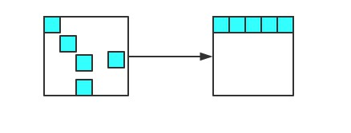

栈和堆

栈垃圾回收<br /> 当函数执行结束，JS 引擎通过向下移动 ESP 指针（记录调用栈当前执行状态的指针），来销毁该函数保存在栈中的执行上下文（变量环境、词法环境、this、outer）。

堆垃圾回收<br /> 一、代际假说 <br />1、大部分对象存活时间很短 <br />2、不被销毁的对象，会活的更久

二、分类<br /> V8 中会把堆分为新生代和老生代两个区域，新生代中存放的是生存时间短的对象，老生代中存放的生存时间久的对象。<br /> <br />三、新生代 <br />算法：Scavenge 算法 <br />原理： <br />1、把新生代空间对半划分为两个区域，一半是对象区域，一半是空闲区域。 <br />2、新加入的对象都会存放到对象区域，当对象区域快被写满时，就需要执行一次垃圾清理操作。<br /> 3、先对对象区域中的垃圾做标记，标记完成之后，把这些存活的对象复制到空闲区域中<br /> 4、完成复制后，对象区域与空闲区域进行角色翻转，也就是原来的对象区域变成空闲区域，原来的空闲区域变成了对象区域。 <br />对象晋升策略：

- 经过两次垃圾回收依然还存活的对象，会被移动到老生区中。
- 内存超过 25%

四、老生代

算法：标记 - 清除（Mark-Sweep）算法<br /> 原理：<br /> 1、标记：标记阶段就是从一组根元素开始，递归遍历这组根元素，在这个遍历过程中，能到达的元素称为活动对象，没有到达的元素就可以判断为垃圾数据。<br /> 2、清除：将垃圾数据进行清除。 碎片： 对一块内存多次执行标记 - 清除算法后，会产生大量不连续的内存碎片。而碎片过多会导致大对象无法分配到足够的连续内存。

算法：标记 - 整理（Mark-Compact）算法 <br />原理：<br /> 1、标记：和标记 - 清除的标记过程一样，从一组根元素开始，递归遍历这组根元素，在这个遍历过程中，能到达的元素标记为活动对象。<br /> 2、整理：让所有存活的对象都向内存的一端移动 3、清除：清理掉端边界以外的内存

优化算法：增量标记（Incremental Marking）算法<br /> 原理： 1、为了降低老生代的垃圾回收而造成的卡顿 <br />2、V8 把一个完整的垃圾回收任务拆分为很多小的任务 <br />1、让垃圾回收标记和 JavaScript 应用逻辑交替进行

JS 语言不像 C/C++, 让程序员自己去开辟或者释放内存，而是类似 Java，采用自己的一套垃圾回收算法进行自动的内存管理。作为一名资深的前端工程师，对于 JS 内存回收的机制是需要非常清楚, 以便于在极端的环境下能够分析出系统性能的瓶颈，另一方面，学习这其中的机制，也对我们深入理解 JS 的闭包特性、以及对内存的高效使用，都有很大的帮助。

## V8 内存限制

在其他的后端语言中，如 Java/Go, 对于内存的使用没有什么限制，但是 JS 不一样，V8 只能使用系统的一部分内存，具体来说，在`64`位系统下，V8 最多只能分配`1.4G`, 在 32 位系统中，最多只能分配`0.7G`。你想想在前端这样的大内存需求其实并不大，但对于后端而言，nodejs 如果遇到一个 2G 多的文件，那么将无法全部将其读入内存进行各种操作了。

我们知道对于栈内存而言，当 ESP 指针下移，也就是上下文切换之后，栈顶的空间会自动被回收。但对于堆内存而言就比较复杂了，我们下面着重分析堆内存的垃圾回收。

> ESP（Extended Stack Pointer）为扩展栈指针寄存器，是指针寄存器的一种，用于存放函数栈顶指针

上一篇我们提到过了，所有的对象类型的数据在 JS 中都是通过堆进行空间分配的。当我们构造一个对象进行赋值操作的时候，其实相应的内存已经分配到了堆上。你可以不断的这样创建对象，让 V8 为它分配空间，直到堆的大小达到上限。

那么问题来了，V8 为什么要给它设置内存上限？明明我的机器大几十 G 的内存，只能让我用这么一点？

究其根本，是由两个因素所共同决定的，一个是 JS 单线程的执行机制，另一个是 JS 垃圾回收机制的限制。

首先 JS 是单线程运行的，这意味着一旦进入到垃圾回收，那么其它的各种运行逻辑都要暂停; 另一方面垃圾回收其实是非常耗时间的操作，V8 官方是这样形容的:

> 以 1.5GB 的垃圾回收堆内存为例，V8 做一次小的垃圾回收需要 50ms 以上，做一次非增量式(ps:后面会解释)的垃圾回收甚至要 1s 以上。

可见其耗时之久，而且在这么长的时间内，我们的 JS 代码执行会一直没有响应，造成应用卡顿，导致应用性能和响应能力直线下降。因此，V8 做了一个简单粗暴的选择，那就是限制堆内存，也算是一种权衡的手段，因为大部分情况是不会遇到操作几个 G 内存这样的场景的。

不过，如果你想调整这个内存的限制也不是不行。配置命令如下:

```javascript
// 这是调整老生代这部分的内存，单位是MB。后面会详细介绍新生代和老生代内存
node --max-old-space-size=2048 xxx.js
```

或者

```javascript
// 这是调整新生代这部分的内存，单位是 KB。
node --max-new-space-size=2048 xxx.js
```

## 新生代内存的回收

V8 把堆内存分成了两部分进行处理——新生代内存和老生代内存。顾名思义，新生代就是临时分配的内存，存活时间短， 老生代是常驻内存，存活的时间长。V8 的堆内存，也就是两个内存之和。


根据这两种不同种类的堆内存，V8 采用了不同的回收策略，来根据不同的场景做针对性的优化。

首先是新生代的内存，刚刚已经介绍了调整新生代内存的方法，那它的内存默认限制是多少？在 64 位和 32 位系统下分别为 32MB 和 16MB。够小吧，不过也很好理解，新生代中的变量存活时间短，来了马上就走，不容易产生太大的内存负担，因此可以将它设的足够小。

那好了，新生代的垃圾回收是怎么做的呢？

首先将新生代内存空间一分为二:


其中 From 部分表示正在使用的内存，To 是目前闲置的内存。

当进行垃圾回收时，V8 将 From 部分的对象检查一遍，如果是存活对象那么复制到 To 内存中(在 To 内存中按照顺序从头放置的)，如果是非存活对象直接回收即可。

当所有的 From 中的存活对象按照顺序进入到 To 内存之后，From 和 To 两者的角色`对调`，From 现在被闲置，To 为正在使用，如此循环。

那你很可能会问了，直接将非存活对象回收了不就万事大吉了嘛，为什么还要后面的一系列操作？

注意，我刚刚特别说明了，在 To 内存中按照顺序从头放置的，这是为了应对这样的场景:<br />

深色的小方块代表存活对象，白色部分表示待分配的内存，由于堆内存是连续分配的，这样零零散散的空间可能会导致稍微大一点的对象没有办法进行空间分配，这种零散的空间也叫做**内存碎片**。刚刚介绍的新生代垃圾回收算法也叫**Scavenge 算法**。

Scavenge 算法主要就是解决内存碎片的问题，在进行一顿复制之后，To 空间变成了这个样子:


是不是整齐了许多？这样就大大方便了后续连续空间的分配。

不过 Scavenge 算法的劣势也非常明显，就是内存只能使用新生代内存的一半，但是它只存放生命周期短的对象，这种对象`一般很少`，因此`时间`性能非常优秀。

## 老生代内存的回收

刚刚介绍了新生代的回收方式，那么新生代中的变量如果经过多次回收后依然存在，那么就会被放入到`老生代内存`中，这种现象就叫`晋升`。

发生晋升其实不只是这一种原因，我们来梳理一下会有那些情况触发晋升:

- 经过两次垃圾回收依然还存活的对象
- To（闲置）空间的内存占用超过 25%。

现在进入到老生代的垃圾回收机制当中，老生代中累积的变量空间一般都是很大的，当然不能用`Scavenge`算法啦，浪费一半空间不说，对庞大的内存空间进行复制岂不是劳民伤财？

那么对于老生代而言，究竟是采取怎样的策略进行垃圾回收的呢？

**第一步**，进行标记-清除。这个过程在《JavaScript 高级程序设计(第三版)》中有过详细的介绍，主要分成两个阶段，即标记阶段和清除阶段。首先会遍历堆中的所有对象，对它们做上标记，然后对于代码环境中`使用的变量`以及被`强引用`的变量取消标记，剩下的就是要删除的变量了，在随后的`清除阶段`对其进行空间的回收。

当然这又会引发内存碎片的问题，存活对象的空间不连续对后续的空间分配造成障碍。老生代又是如何处理这个问题的呢？

**第二步**，标记 - 整理。在清除阶段结束后，把存活的对象全部往一端靠拢。



由于是移动对象，它的执行速度不可能很快，事实上也是整个过程中最耗时间的部分。

## 增量标记和惰性删除

> V8 将标记过程分为一个个的子标记过程，同时让垃圾回收标记和 JavaScript 应用逻辑交替进行，直到标记阶段完成，我们把这个算法称为增量标记（Incremental Marking）算法。

由于 JS 的单线程机制，V8 在进行垃圾回收的时候，不可避免地会阻塞业务逻辑的执行，倘若老生代的垃圾回收任务很重，那么耗时会非常可怕，严重影响应用的性能。那这个时候为了避免这样问题，V8 采取了增量标记的方案，即将一口气完成的标记任务分为很多小的部分完成，每做完一个小的部分就"歇"一下，就 js 应用逻辑执行一会儿，然后再执行下面的部分，如果循环，直到标记阶段完成才进入内存碎片的整理上面来。其实这个过程跟 React Fiber 的思路有点像，这里就不展开了。

增量标记完成后，惰性清理就开始了。所有的对象已被处理，因此非死即活，堆上多少空间可以变为空闲已经成为定局。此时我们可以不急着释放那些空间，而将清理的过程延迟一下也并无大碍。因此无需一次清理所有的页，垃圾回收器会视需要逐一进行清理，直到所有的页都清理完毕。这时增量标记又蓄势待发了。

JS 垃圾回收的原理就介绍到这里了，其实理解起来是非常简单的，重要的是理解它`为什么要这么做`，而不仅仅是`如何做的`，希望这篇总结能够对你有所启发。

## other

### 引用计数垃圾收集

这是最初级的垃圾收集算法。此算法把“对象是否不再需要”简化定义为“对象有没有其他对象引用到它”。如果没有引用指向该对象（零引用），对象将被垃圾回收机制回收。<br />该算法有个限制：无法处理循环引用。

# 参考文章

[三元博客](https://sanyuan0704.top)
[JS 垃圾回收机制笔记](https://juejin.cn/post/6844903695721709581#heading-24)
[V8 之旅： 垃圾回收器](http://newhtml.net/v8-garbage-collection/)
